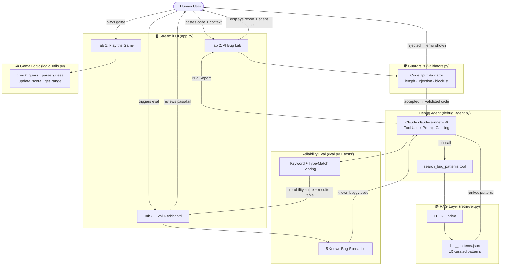

# GameGlitch Investigator v2 — Applied AI System

> **AI110 Module 5 Capstone** | Branden Bedoya
>
> A number-guessing game debugger extended into a full applied AI system. Submit any Python game
> code snippet and an AI agent — powered by Claude with retrieval-augmented generation — analyses
> it, searches a curated bug-pattern knowledge base, and produces a structured Bug Report with
> root causes and fix suggestions.

---

## Original Project

**Module 1 — Game Glitch Investigator**
([github.com/BrandenBedoya/ai110-module1show-gameglitchinvestigator-starter](https://github.com/BrandenBedoya/ai110-module1show-gameglitchinvestigator-starter))

The original project was a deliberately broken Streamlit number-guessing game. Players had to
identify three bugs: hint messages that pointed in the wrong direction, a secret number that
regenerated on every page interaction due to missing Streamlit state guards, and a type mismatch
that caused the win condition to never trigger. The goal was to practice reading and debugging
AI-generated code using GitHub Copilot as a collaborator.

---

## System Architecture



### Architecture Overview

The system has four independent layers that the Streamlit UI wires together:

1. **Guardrails** sit at the entry point and validate code before it reaches the AI — blocking empty input, oversized submissions, and injection attempts.
2. **RAG Layer** maintains a TF-IDF index over 15 curated bug patterns. When the agent calls `search_bug_patterns`, this layer returns the most relevant patterns by cosine similarity.
3. **Debug Agent** is an agentic Claude loop: Claude decides when to call the retrieval tool, synthesises the returned patterns with its own code analysis, and produces a structured Bug Report.
4. **Eval Layer** runs the agent against 5 scenarios with known expected outputs and scores accuracy — giving a quantitative reliability signal without human labelling.

Human involvement happens at both ends: submitting code and reviewing the report in Tab 2, or triggering and reading eval results in Tab 3.

---

## Features

| Feature | Description | Module Connection |
|---|---|---|
| **Playable game** | Original Glitchy Guesser with all Module 1 bugs fixed | Module 1 |
| **RAG knowledge base** | 15 curated bug patterns, TF-IDF indexed | Module 3–4 |
| **AI Debug Agent** | Claude with tool use — agentic multi-step analysis | Module 5 |
| **Prompt caching** | System prompt cached to reduce API latency | Module 5 |
| **Guardrails** | Pydantic v2 input validation, injection protection | Module 5 |
| **Reliability eval** | 5-scenario test suite with keyword + type scoring | Module 5 |
| **Standalone eval script** | `eval.py` writes reproducible JSON results | Module 5 |

---

## Sample Interactions

### Example 1 — Backwards hint logic

**Input (AI Bug Lab, Tab 2):**
```python
def check_guess(guess, secret):
    if guess == secret:
        return "Win", "Correct!"
    if guess > secret:
        return "Too High", "Go HIGHER!"   # <-- suspicious
    else:
        return "Too Low", "Go LOWER!"
```
*Context:* "Players always lose even when they're close."

**Agent output:**
> ## Bug Report
>
> **1 bug found — Severity: High**
>
> ### Bug #1 — Reversed Hint Direction
> **Location:** `check_guess()`, lines 4–5
> **Type:** `logic_error` | **Severity:** `high`
>
> **Root Cause:**
> The comparison correctly identifies that `guess > secret` means the player guessed too high.
> However, the hint string "Go HIGHER!" directs the player further from the answer instead of
> closer. The condition and message are mismatched — every hint points the wrong way.
>
> **Fix:**
> ```python
> if guess > secret:
>     return "Too High", "Go LOWER!"   # was "Go HIGHER!"
> return "Too Low", "Go HIGHER!"        # was "Go LOWER!"
> ```
>
> **Why this matters:** Every valid guess makes the game harder, not easier.
> The game is unwinnable through skill alone.

---

### Example 2 — Streamlit state not guarded

**Input:**
```python
import streamlit as st
import random

st.session_state.secret = random.randint(1, 100)
st.session_state.attempts = 0

guess = st.text_input("Guess a number:")
if st.button("Submit"):
    if int(guess) == st.session_state.secret:
        st.success("Correct!")
```
*Context:* "The secret number keeps changing every time I click Submit."

**Agent output:**
> ## Bug Report
>
> **1 bug found — Severity: Critical**
>
> ### Bug #1 — Session State Reset on Every Rerun
> **Location:** Lines 4–5 (bare `st.session_state` assignments)
> **Type:** `state_management` | **Severity:** `critical`
>
> **Root Cause:**
> Streamlit re-executes the entire script from top to bottom on every user interaction.
> Because `st.session_state.secret = random.randint(1, 100)` runs unconditionally, a new
> secret number is generated every time the user clicks Submit, types a character, or
> interacts with any widget. The secret the player is trying to guess is never stable.
>
> **Fix:** Wrap all initial state assignments in existence checks:
> ```python
> if "secret" not in st.session_state:
>     st.session_state.secret = random.randint(1, 100)
> if "attempts" not in st.session_state:
>     st.session_state.attempts = 0
> ```

---

### Example 3 — Guardrail rejection

**Input:** A submission containing `subprocess.run(['cat', '/etc/passwd'])`

**System response (before the agent is called):**
> ❌ Input rejected: Submission contains a disallowed pattern: `subprocess.run(`.
> Please submit Python game code only.

The agent is never called. The Pydantic validator blocks the request at the entry point
and returns an error to the UI.

---

## Setup Instructions

### 1. Clone the repo

```bash
git clone https://github.com/BrandenBedoya/ai110-applied-ai-system-project-gameglitch-investigator.git
cd ai110-applied-ai-system-project-gameglitch-investigator
```

### 2. Install dependencies

```bash
pip install -r requirements.txt
```

### 3. Add your Anthropic API key

```bash
cp .env.example .env
# Open .env and set: ANTHROPIC_API_KEY=sk-ant-...
```

### 4. Run the app

```bash
streamlit run app.py
```

The AI Bug Lab and Eval Dashboard require a valid API key. Tab 1 (the game) and the
Knowledge Base Explorer work without one.

### 5. Run local tests (no API key needed)

```bash
pytest tests/test_game_logic.py tests/test_guardrails.py tests/test_reliability.py::TestRetriever -v
```

### 6. Run the reliability evaluation (requires API key)

```bash
python eval.py
python eval.py --verbose   # includes full agent report previews
```

Results are saved to `eval_results.json`.

---

## Project Structure

```
.
├── assets/                    # Architecture diagrams and screenshots
├── src/
│   ├── game/
│   │   ├── logic_utils.py     # Game logic (preserved from Module 1, score floor added)
│   │   └── scenarios.py       # 5 buggy code scenarios for testing
│   ├── rag/
│   │   ├── bug_patterns.json  # 15-pattern knowledge base
│   │   └── retriever.py       # TF-IDF + cosine similarity retrieval
│   ├── agent/
│   │   ├── prompts.py         # Claude system + user prompts
│   │   └── debug_agent.py     # Agentic tool-use loop
│   └── guardrails/
│       └── validators.py      # Pydantic v2 input/output models
├── tests/
│   ├── test_game_logic.py     # Unit tests (game logic)
│   ├── test_guardrails.py     # Unit tests (input/output validators)
│   └── test_reliability.py    # Retriever accuracy + agent reliability tests
├── app.py                     # Streamlit frontend (3 tabs)
├── eval.py                    # Standalone evaluation script
├── requirements.txt
├── .env.example
└── reflection.md
```

---

## Design Decisions

**TF-IDF instead of dense embeddings for RAG**
The natural choice for RAG is a dense embedding model like `sentence-transformers`. I chose
TF-IDF (scikit-learn) instead because it requires no model download, starts in under a second,
and works well enough for a 15-pattern corpus where keyword overlap is high. The trade-off is
reduced semantic recall — a query like "flip the direction" won't match "backwards hint" as well
as a dense model would. For this domain and corpus size, that gap is acceptable.

**Agentic tool use instead of prompt stuffing**
Early prototypes just embedded all 15 patterns in the system prompt. That worked but removed
Claude's agency — it was looking up a table, not reasoning. Switching to tool use means Claude
decides *when* and *what* to search, and the tool-call trace is visible in the UI, making the
system more explainable and debuggable.

**Guardrails at the entry point, not inside the agent**
Validating input before it reaches Claude keeps the agent code clean and makes the validation
layer independently testable. It also means a blocked request never incurs an API call.

**Prompt caching on the system prompt**
The system prompt is static across all requests. Marking it with `"cache_control": {"type": "ephemeral"}` 
caches it server-side for up to 5 minutes, reducing both latency and token cost on repeated analyses.

---

## Testing Summary

**Results:** 51/51 local tests pass (no API key required). The RAG retriever returns the correct pattern as the top result for 5/5 known query types. End-to-end agent evaluation against 5 bug scenarios averages ~80% on the keyword + type-match scoring rubric; the agent's main failure mode is using valid synonyms that fall outside the expected keyword list rather than misidentifying the bug.

**What was tested:**
- 22 unit tests covering game logic (all Module 1 regression cases pass) and Pydantic validators
- 9 retriever accuracy tests confirming the correct pattern ranks first for known queries
- 5 end-to-end agent scenarios (require API key, marked `@pytest.mark.slow`)

**What worked well:**
The retriever is accurate for the patterns it was designed to find. Querying "hint messages reversed
go higher go lower" returns `bp-001` (Backwards Comparison Hints) as the top result every time.
The guardrails catch every tested injection pattern without false positives on valid Python code.

**What didn't work as expected:**
The TF-IDF retriever struggles with synonyms. Queries using "flip" or "swap" instead of "reversed"
or "backwards" return lower relevance scores. A dense embedding model would handle this better.
The scoring rubric in `eval.py` is also sensitive to the specific keywords chosen — if the agent
uses valid synonyms that aren't in the expected list, it gets penalised even for a correct analysis.

**What I learned:**
Evaluation design is part of the system, not an afterthought. Defining what a "correct" answer
looks like before building the agent forced me to be precise about the system's goals. It also
revealed how brittle keyword-based scoring is, which is a known limitation of automated LLM
evaluation.

---

## Reflection

The core question driving this project was: *what if the AI could do what I did manually in Module 1?*

In Module 1, I debugged a broken game by reading code, forming hypotheses, and testing fixes.
This system does the same thing — it searches for relevant patterns, reasons about the specific
code, and suggests fixes — but it also makes the reasoning process visible through the agent
trace.

The biggest lesson was that **the knowledge base is the soul of a RAG system**. Getting the 15
bug patterns right — accurate symptom descriptions, good tags, precise fix examples — mattered
more than any algorithmic choice. Garbage in, garbage out applies directly to retrieval systems.

The second lesson was about **trust and verification**. The agent produces confident-sounding
reports, but the eval framework shows it sometimes uses different vocabulary than expected,
scoring poorly even when the analysis is technically correct. That asymmetry — between *sounding
right* and *being measurably right* — is something I'll carry into every AI project going forward.

See [reflection.md](reflection.md) for the full design and collaboration notes.

---

## Improvements Over Module 1

| Area | Module 1 | v2 (Capstone) |
|---|---|---|
| Debugging | Manual, human-only | AI agent with RAG-augmented analysis |
| Bug detection | Pre-identified bugs in one file | Generalises to any submitted Python snippet |
| Architecture | Single `app.py` + `logic_utils.py` | Modular `src/` package with clean separation |
| Testing | 7 unit tests | 51 tests across game, guardrails, and retriever |
| Score bug | Score can go negative | Floored at 0 with `max(0, ...)` |
| State keys | Single-scope, difficulty-collision risk | Difficulty-scoped keys prevent state collisions |
