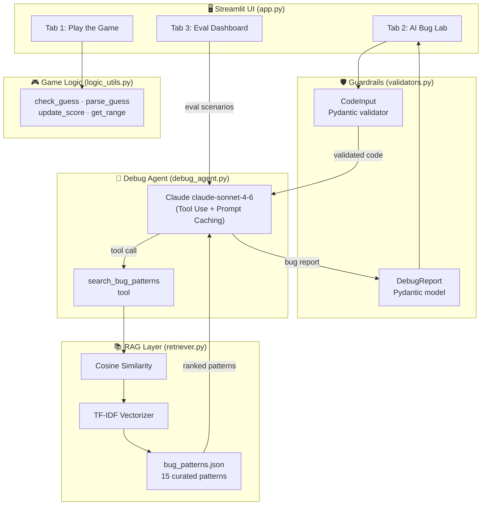

# GameGlitch Investigator v2 — Applied AI System

> **AI110 Module 5 Capstone** | Branden Bedoya
>
> An extension of the Module 1 Game Glitch Investigator that evolves a manual debugging exercise
> into a full applied AI system — combining RAG retrieval, an agentic Claude workflow, Pydantic
> guardrails, and a structured reliability evaluation framework.

---

## System Architecture



---

## Features

| Feature | Description | Module Connection |
|---|---|---|
| **Playable game** | Original Glitchy Guesser with all Module 1 bugs fixed | Module 1 |
| **RAG knowledge base** | 15 curated bug patterns, TF-IDF indexed | Module 3-4 |
| **AI Debug Agent** | Claude claude-sonnet-4-6 with tool use — agentic multi-step analysis | Module 5 |
| **Prompt caching** | System prompt cached across API calls to reduce latency | Module 5 |
| **Guardrails** | Pydantic v2 input validation, injection protection, length limits | Module 5 |
| **Reliability eval** | 5 scenario test suite with keyword + type-match scoring | Module 5 |
| **Standalone eval script** | `eval.py` outputs JSON results for reproducible benchmarking | Module 5 |

---

## Quickstart

### 1. Clone the repo

```bash
git clone https://github.com/BrandenBedoya/ai110-applied-ai-system-project-gameglitch-investigator.git
cd ai110-applied-ai-system-project-gameglitch-investigator
```

### 2. Install dependencies

```bash
pip install -r requirements.txt
```

### 3. Add your API key

```bash
cp .env.example .env
# Edit .env and set ANTHROPIC_API_KEY=sk-ant-...
```

### 4. Run the app

```bash
streamlit run app.py
```

### 5. Run tests (no API key needed for unit + guardrail tests)

```bash
pytest tests/test_game_logic.py tests/test_guardrails.py tests/test_reliability.py::TestRetriever -v
```

### 6. Run the reliability evaluation

```bash
python eval.py
python eval.py --verbose   # includes full agent report previews
```

---

## Project Structure

```
.
├── assets/                    # Architecture diagrams and screenshots
├── src/
│   ├── game/
│   │   ├── logic_utils.py     # Game logic (from Module 1, improved)
│   │   └── scenarios.py       # 5 buggy code scenarios for testing
│   ├── rag/
│   │   ├── bug_patterns.json  # 15-pattern knowledge base
│   │   └── retriever.py       # TF-IDF + cosine similarity retrieval
│   ├── agent/
│   │   ├── prompts.py         # Claude system + user prompts
│   │   └── debug_agent.py     # Agentic tool-use loop
│   └── guardrails/
│       └── validators.py      # Pydantic v2 input/output models
├── tests/
│   ├── test_game_logic.py     # Unit tests (game)
│   ├── test_guardrails.py     # Unit tests (validators)
│   └── test_reliability.py    # Retriever + agent reliability tests
├── app.py                     # Streamlit frontend (3 tabs)
├── eval.py                    # Standalone evaluation script
├── requirements.txt
├── .env.example
└── reflection.md
```

---

## AI Components Explained

### RAG Knowledge Base
`src/rag/bug_patterns.json` contains 15 hand-curated bug patterns covering:
- Logic errors (backwards hints, wrong formulas, operator mistakes)
- State management bugs (Streamlit session_state, reset failures)
- Type errors (int vs string comparison)
- Input validation gaps
- Control flow issues (missing game-over guards)

The `BugRetriever` class builds a TF-IDF index at startup and returns top-k patterns
ranked by cosine similarity for any query.

### Agentic Debug Agent
`src/agent/debug_agent.py` implements a multi-step tool-use loop:

1. Claude receives the submitted code and a prompt to call `search_bug_patterns` first.
2. Claude calls the tool with a relevant query.
3. The tool executes RAG retrieval and returns ranked patterns.
4. Claude synthesises the retrieved patterns with its own code analysis.
5. Claude produces a structured Bug Report (no further tool calls).

The system prompt is cached using Anthropic's prompt caching feature to reduce API latency
on repeated calls.

### Guardrails
`src/guardrails/validators.py` uses Pydantic v2 to:
- Reject empty or oversized code submissions (>5000 chars)
- Block prompt injection attempts
- Block shell execution patterns (os.system, subprocess, eval)
- Truncate context strings to 500 characters
- Validate and clamp structured output fields (confidence, severity, bug count)

### Reliability Scoring
Each evaluation scenario has a documented `expected_bug_type` and `expected_keywords`.
The agent is scored on:
- **50%** — whether the expected bug type appears in the report
- **50%** — fraction of expected keywords found in the report

---

## Improvements Over Module 1

| Area | Module 1 | v2 (Capstone) |
|---|---|---|
| Debugging | Manual, human-only | AI agent with RAG-augmented analysis |
| Bug detection | Pre-identified bugs in starter code | Generalises to any submitted Python snippet |
| Architecture | Single `app.py` + `logic_utils.py` | Modular `src/` package with clean separation |
| Testing | 7 unit tests | 30+ tests across game, guardrails, and retriever |
| Score bug | Score can go negative | Floored at 0 with `max(0, ...)` |
| State keys | Single-scope, difficulty-collision risk | Difficulty-scoped keys prevent state collisions |

---

## Portfolio Notes

This project demonstrates:
- **Retrieval-Augmented Generation (RAG)** without heavy ML dependencies
- **Agentic AI** using the Anthropic tool-use API
- **Responsible AI design**: input guardrails, output validation, and structured evaluation
- **Clean Python architecture**: modular `src/` layout, Pydantic models, typed interfaces
- **Reliability mindset**: automated test suite + eval script with JSON output
